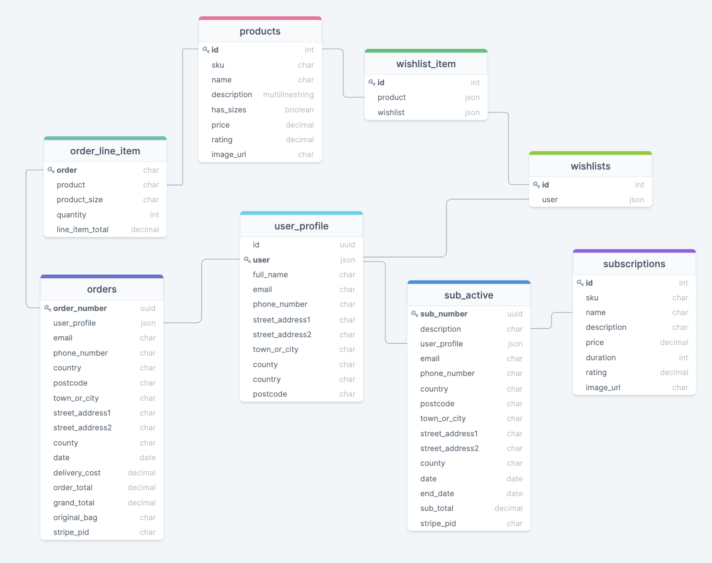
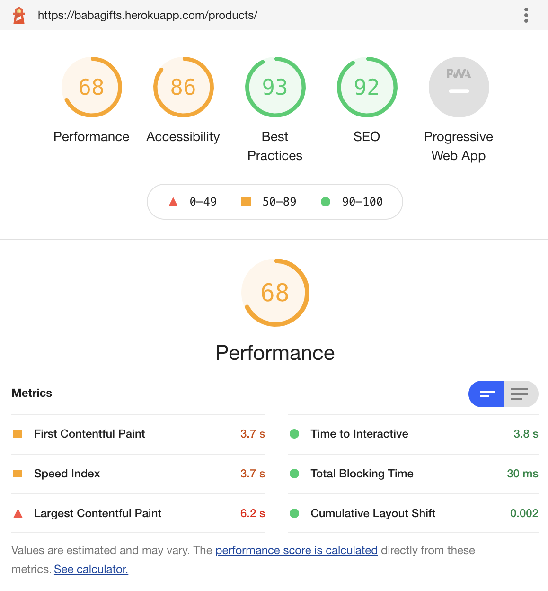
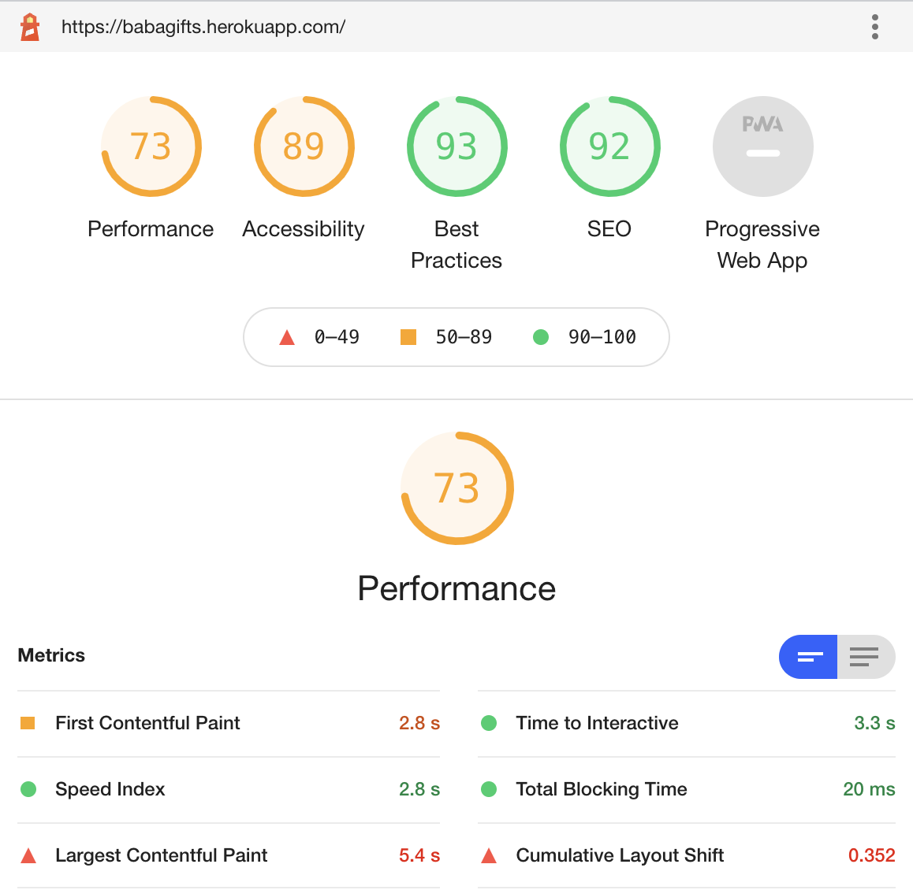
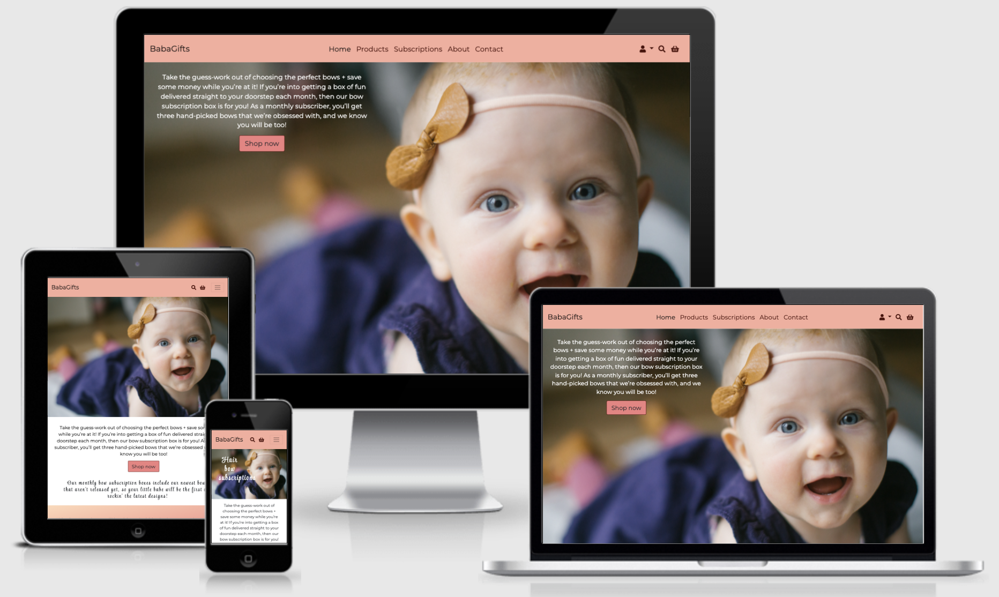
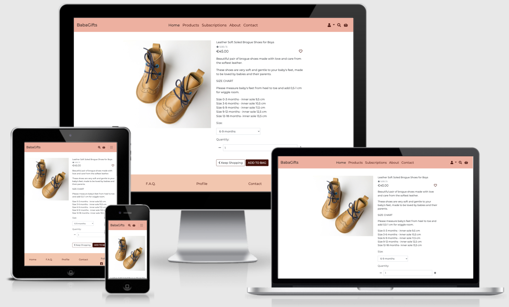

# Baba Gifts


This is an eCommerce store with Stripe integrated payment processing. It is fully responsive and accessible on a range of devices, making it easy to navigate for potential clients. It was created using Django framework and hosted on Heroku.

View live project [here](http://babagifts.herokuapp.com/)

## User Experience (UX)
### Developer's Goals
It is a final project of the Full Stack Web Development course provided by Code Institute. It's main purpose is to learn how to build e-commerce websites using Django.  

### Site Owner Goals
The primary goal of the site owner is to nicely present items for sale and subsequently sell them. Site owner would need an easy access
to product management in order to be able to add, update, or delete products. 

### Customers' goals
The main audience for this website consists of yound parents and their close family or friends who would like to purchase unique items 
for babies. They value quality and craftmanship and don't mind paying more for handmade products.

### User stories
As a/an .. | I want to be able to ..
--------|------------------------
First time user | easily understand the main purpose of the site and learn more about the company.
First time user | easily navigate throughout the site to find content.
Shopper | see a list of products available for purchase.
Shopper | see each product in more detail.
Shopper | add product or multiple products to basket.
Shopper | see products in my basket.
Shopper | easily see the total of my purchases at any time.
Shopper | update my basket (quantity, sizes, etc).
Shopper | delete products from basket.
Shopper | go to checkout and see a summary of the products I am buying.
Shopper | purchase products without creating an account.
Shopper | get confirmation of my purchase.
Shopper | save my details for future purchases.
Registered user | update my saved information.
Registered user | delete my account.
Registered user | see my previous purchases.
Registered user | save items to a wishlist.
Registered user | see my wishlist and delete items from it.
Admin | add new, edit or delete products.
Admin | add new, edit or delete categories.

### Design
* #### Color scheme
    The following color pallete was created using [Coolors](https://coolors.co/). I chose soft pinkish colors to emphasize 
    the theme and stimulate purchases.
    

* #### Typography
    This project uses Montserrat as a main font and Style Script font for headings. Both fonts are provided by [Google Fonts](https://fonts.google.com/)

* #### Imagery 
    Most of the pictures are from private collections, while some were downloaded from [Pexels](https://www.pexels.com/)

* #### Icons
    Icons are used throughout this website in an attempt to increase UX design where possible. All icons were chosen for their obvious meaning so that they can be easily understood by everyone. They were taken from [FontAwesome](https://fontawesome.com/).

### Wireframes
* Wireframes for large screens - [view](https://github.com/irasan/babagifts/blob/master/assets/wireframes/desktop_view.pdf)
* Wireframes for medium screens - [view](https://github.com/irasan/babagifts/blob/master/assets/wireframes/tablet_view.pdf)
* Wireframes for small screens - [view](https://github.com/irasan/babagifts/blob/master/assets/wireframes/phone_view.pdf)


## Features
### Existing Features
* The navbar contains a logo(name) on top left corner to redirect to the landing page. Different site sections (Home, Products, Subscriptions, About and Contact) are placed in the center. In the right corner three icons are displayed: profile, search and shopping bag. Profile icon has a dropdown submenu which changes depending on user being logged in or not. If the user is not logged in, account submenu will show Register and Login links. If the user is logged in, he'll see Profile, Wishlist and Logout links. If a superuser is logged in, account submenu will also show Product Management submenu. Search input field will appear when clicking on search icon. It allows to search products and subscriptions. Shopping bag dispays quantity of the items currently put there.  
* The footer shows links to the following pages: Home, F.A.Q., Contact, Profile, and social media icons. 
* User authentication: users can register their profiles, log in and log out. 
* On the profile page users can see their default info if any and change it. Subscriptions and past orders will also be displayed. There's also a button to user's wishlist. 
* Any user can browse different products and subscriptions.
* Logged in users can save products to a wishlist and see if those products have already been saved (red heart icon will indicate this)
* Any user can buy different products, while subscriptions are only available to registered users.
* Any user (logged in or not) can checkout securely.
* Any user can see confirmations / error messages when completing actions on the website.
* Any user can receive confirmation emails for order when compliting order form during checkout.
* The admin can add, update and remove products via admin page or via website.
* Any user can send a message to site owners through contact page.
* Any user can subscribe to a newsletter by providing their email address.

### Other features include:
* Stripe Integration.
* Webhooks.
* Admin Panel.
* Error Handling.
* Payment Error Capturing - Checkout first creates an order instance in the database, before trying to checkout, this way a user will not get charged multiple times if checkout page is refreshed etc.
* Responsive Design.

### Features left to implement
* Product rating
* Additional info messages for users.
* Proper subscriptions with recurring payments and options to edit or cancel them.
* Add more defensive programming features.

## Technologies used
### Languages:
* HTML
* CSS
* Python
* JavaScript.

### Tools 
* [GitPod](https://gitpod.io/) for creating the project;
* [GitHub](https://github.com/) for version control;
* [PIP](https://pypi.org/project/pip/) for installation of tools needed in this project;
* [Heroku](https://www.heroku.com/) and Postgres database for deployment;
* [Balsamiq](https://balsamiq.com/) was used to create wireframes for the project;
* [Favicon generator](https://www.favicon-generator.org/) was used to generate the favicon;
* [Stripe](https://stripe.com/) is used to handle payments for the website.
* [AWS S3](https://aws.amazon.com/) for storing static files.

### Libraries
* [FontAwesome](https://fontawesome.com/) to provide icons;
* [Google Fonts](https://fonts.google.com/) to style website's fonts;
* [JQuery](https://jquery.com/) to simplify DOM manipulation;
* [Jinja](https://jinja.palletsprojects.com/) to simplify displaying data from the backend of this project smoothly and effectively in html;
* [Bootstrap](https://getbootstrap.com/) to simplify styling of the website and make it responsive easily;
* [Django](https://www.djangoproject.com/) to build the project.
* [Am I Responsive](http://ami.responsivedesign.is/) to create the images in this readme file of each page displayed on different screen sizes.


## Information Architecture
### Database Choice
The site is linked with the SQlite3 database in development and PostgreSQL in production to allow users to easily obtain information needed. Static files are hosted on AWS.

### Collections Data Structure
This website relies on 2 different pre-filled tables - Products and Subscriptions. All other tables are created during interaction
between users and website.



## Testing
### Testing Using Validators
Upon completion of the writing process, developer used [W3C CSS Validation Service](https://jigsaw.w3.org/css-validator/),
[W3C MarkUp Validation Service](https://validator.w3.org/), and [PEP8 online](http://pep8online.com/) to check the validity of the code. Code passed the tests with some errors that cannot be fixed. For example, too long lines that cannot be shortened or split in two. Some other errors, like unused imports in files automatically created by Django, were also left untouched.

Website was also tested using [Lighhouse](https://developers.google.com/web/tools/lighthouse). The following reports were generated on home and products pages:




### Manual Testing
The website was continuously tested on emulated large and small screens when writing the code. 
Manual testing was used to test navigation, responsiveness on different screen sizes, database operations 
(Create, Read, Update and Delete) and application functions.

### Client Stories Testing
All client stories developed in the beginning of the project were tested. Only two of them were not fulfilled:
* As a shopper I want to see the total of my purchases at any time - the total quantity was replaced with items count
in the shopping bag. Its is always seen beside the bag icon in the navbar.
* As a registered user I want to be able to delete my account - this was left for future development.

#### Test cases
Here's a list of some test cases that were done (a small part of them):
1. A user can register an account with unique username - Pass;
1. A user cannot register an account with a username that already exists in the database - Pass;
1. Registered user can login and logout using their credentials - Pass;
1. Registered user can save their default info to profile - Pass;
1. User can see a list of products - Pass;
1. User can go to product page and see it's details - Pass; 
1. User can add products to shopping bag - Pass;
1. User can see items in the shopping bag - Pass;
1. User can update quantity or delete items from the shopping bag - Pass;
1. Delivery costs are calculated correctly - Pass;
1. Logged in user can make a purchase - Pass;
1. Anonymous user can make a purchase - Pass;
1. User can see a list of subscriptions - Pass;
1. Only registered users can buy a subscription - Pass;
1. Registered user can add products to a wishlist on the main product page or on the product details page - Pass;
1. Registered user can see what items on the main product page are already in the wishlist - Pass;
1. Registered user can see items in the wishlist on the wishlist page - Pass;
1. Anonymous user cannot create a wishlist, but can see such an option - Pass; 
1. User can send email using contact form - Pass;
1. Admin can add and update products/subscriptions through website - Pass;
1. Admin can add and update products/subscriptions in the admin panel - Pass;
1. Admin can delete products with a prompt for confirmation - Pass;
1. User can search products and subscriptions - Pass; 
1. All links are valid and redirect to the proper page - Pass.

### Testing on Different Browsers and Devices
The website was tested and proved to be issue-free on the following browsers:
* Chrome;
* Edge;
* Firefox;
* Safari.

The website was also tested on an IOS (Iphone 10) and Android (Pixel 4) devices. There were detected a few issues, in particular:
* contact form was not centered;
* Shop now button on the home page was too big;
* subscription page was not displayed nicely with some extra margins and poor centering;
* image on the about page was too big on small screens.
All issues stated above were addressed and fixed.

### Bugs and fixes
* When implementing wishlists, I wanted to display on the products page what items were already in the user's wishlist. It was 
easier to do on a product details page, since product id was already used in the view. However, on the page where all products 
are displayed, solution wasn't straight forward. To implement this, I created a function that itirates through each product and add a field "in_wishlist" if it was saved by the user. However, it might be too costly if there are hundreds of products to display.
* At first I aimed to add proper subscriptions to my website. However, by the time I was ready to do that, I have already created User Profile App. Unfortunately, I couldn't find a way under the given time constraints to make peace between Stripe users and my app users. That's why I decided to create subscriptions with one-off payments and no possibility for users to cancel them.
* During deployment, I couldn't export my database tables to Heroku Postgres DB from the first go. It wasn't noticed in time and caused many problems afterwards. I had to create Products and Subscriptions tables again in Heroku. 
* Many bugs were fixed thanks to the debug mode in django. It helped to easily understand what's causing the error and try to fix it. In more difficult cases I could easily search for possible solutions simply by copying and pasting the error wording. 

## Deployment
### Requirements To Deploy:
* Amazon AWS Account
* Heroku Account

### Cloning This Project:
To create a clone, follow the following steps.
1. Log in to GitHub and go to the repository.
1. Click on the button with the text “Code”.
1. Click “Open with GitHub Desktop” and follow the prompts in the GitHub Desktop Application or follow the instructions from GitHub to see how to clone the repository in other ways.

#### To Work With Your Local Clone:
1. Install the requirements from "requirements.txt" (using pip install).
1. Build a new database using "python3 manage.py makemigrations" & "python3 manage.py migrate" commands.
1. Create a new superuser using the "python3 manage.py createsuperuser" and follow the steps.
1. Run the django application using the "python3 manage.py runserver" command.
1. Login using your superuser credentials by adding "/admin" to the url.
1. From the admin panel, you can quickly create, read, update & delete records including products, users, email lists and more.

### Deploying To Heroku & AWS
Static files for this project are hosted on AWS, however postgres database and app functionality are provided by Heroku. This section will walk through the complete deployment sequence for both Heroku & AWS.

To deploy this application on Heroku, we are required to have a requirements.txt file as well as a Procfile. These files will allow Heroku understand what dependencies are required, as well as tell Heroku which file to run, in order to launch the web application.

* Create a procfile: in terminal type "echo web: python run.py > Procfile". You will create a file with "web: python app.py" inside.
* Create a requirements file: type "pip freeze --local > requirements.txt". This file will hold a list of all dependencies required for this project.
* Save and commit changes to GitHub.
* Open Heroku and login or sign up.
* Create a new app and select the desired region.
* Connect Github to Heroku via the dashboard link "Deploy". Go to "Deployment method" and choose "GitHub", find your repository name listed and select it.
* Once connected to GitHub repository, navigate to the "Settings" tab and reveal "Config Vars".
* Create environment variables with your data (ensure names match those in settings.py):
AWS_ACCESS_KEY_ID
AWS_SECRET_ACCESS_KEY
DATABASE_URL
EMAIL_HOST_PASSWORD
EMAIL_HOST_USER
SECRET_KEY
STRIPE_PUBLIC_KEY
STRIPE_SECRET_KEY
STRIPE_WH_SECRET
USE_AWS 
* Now enable "Automatic deploys" and wait till build is complete.
* Click "View" to lunch the app. It won't look nice as static files are stored in AWS.

### For Deployment To AWS (S3 Bucket):
* Log in or sign up to [Amazon AWS](https://signin.aws.amazon.com/) console.
* Under the "AWS services" search box, type "S3" and click the associated service.
* Click "Create Bucket" button, provide a name, and the closest region.
* Uncheck the "Block all public access" checkbox & acknowledge the bucket will be public.
* Click "create bucket" at the end of the form.
* Go to the bucket and click the "Properties" tab; select "static website hosting".
* In the box that pops up, click "Use this bucket to host a website".
* Type "index.html" and "error.html" for the index document & error document fields and save.
* Click on the "Permissions" tab and click on "CORS configuration".
* Paste in the following code into the area provided:
``` 
[ { "AllowedHeaders": [ "Authorization" ], 
    "AllowedMethods": [ "GET" ], 
    "AllowedOrigins": [ "*" ], 
    "ExposeHeaders": [] } 
] 
```
* Click on Bucket policy, copy the "ARN" identifier, then select "Policy Generator".
* Use the following settings for the form:
Policy Type: S3 Bucket Policy,
Add Statements: Effect: "allow", 
Principal: "*", 
Actions: "GetObject" 
ARN: Paste your ARN

* Click "Add Statement", then "Generate Policy".
* Copy the generated policy and paste it back into the bucket policy editor.
* Add "/*" to the end of the "Resource" part of the code and click save.
* Click on the Access Control List under the "Permissions" tab.
* Under the "Everyone (public access)" click the "List Objects", aknowledge that you confirm it & "Save".

Your AWS S3 is now configured. To grant specific access, now follow these steps to allow controlled access via the IAM service on AWS.

* Click on the "Services" tab on the top left of the page and search for "IAM".
* Navigate to the IAM dashboard and under the "Access Management" tab, select "Groups".
* Create a new group by providing a name, then click "next" without any further configuration & "Create Group".
* Click "Policies" under the "Access Management" tab anf then click "Create Policy".
* Open the JSON tab and click "Import Managed Policy".
* Select the "AmazonS3FullAccess" option and click "Import".
Now to only allow specific access to the project bucket. In a new tab go back to the S3 bucket and copy the "ARN" again from the bucket policy page.
Now in the JSON Policy for the IAM group, next to resources remove the "/*" and add the following:
```
"Resource": [ 
   "arn: YOUR ARN CODE",
   "arn: YOUR ARN CODE/*",
]
```
* Click "Review Policy"
* Provide a name and description and click "Create Policy"
* Click on "Groups" under the Access Management section.
* Select the group you have created for this project.
* Under Permissions, click "Attach Policy", select the one that has just been created and click "Attach Policy".

#### Now add a user to the group

* Click the "Users" from under the Access Management section and select "Add User".
* Provide a user name, and select "Programmatic access".
* Click next for permissions.
* Select the group for the project using the checkbox provided.
* Click all the way through to the end without changing any further details.
* At the end of the form you will be given user credentials - download CSV file with user access keys.
* To finalize the setup, add your access keys to the environment variables in the Heroku Config Variables. This will allow your Django application to use these settings on the deployed project.


## Credits
This project was created by following the Code Institute tutorials for the Boutique Ado Django Mini-Project, and customised to meet its unique requirements. 

[Stack Overflow website](https://stackoverflow.com/), [W3School tutorials](https://www.w3schools.com/), 
[Slack](https://code-institute-room.slack.com/ssb/redirect?entry_point=homepage_nav) forum, and tutor support
were used when dealing with some specific issues. 

### Borrowed Code
Hint about removing up and down arrows from quantity input field in the shopping bag was taken [here](https://www.geeksforgeeks.org/how-to-disable-arrows-from-number-input/)

Tutorial on how to link to different section of the same page from [here](https://engineertodeveloper.com/a-better-way-to-route-back-to-a-section-ids-in-django/)

How to calculate some date in the [future](https://stackoverflow.com/questions/546321/how-do-i-calculate-the-date-six-months-from-the-current-date-using-the-datetime)

[Parallax effect](https://www.w3schools.com/howto/howto_css_parallax.asp) and how to make it 
[responsive](https://inkplant.com/code/responsive-parallax-images)

## Previews




