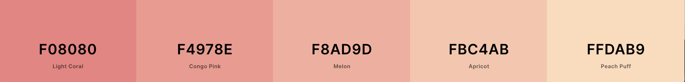

# Baba Gifts

View the live project [here](http://babagifts.herokuapp.com/)

This is an eCommerce store with Stripe integrated payment processing. It is fully responsive and accessible on a range of devices, making it easy to navigate for potential clients. It was created using Django framework.

# User Experience (UX)
* ## User stories
As a/an .. | I want to be able to ..
--------|------------------------
First time user | easily understand the main purpose of the site and learn more about the company.
First time user | easily navigate throughout the site to find content.
Shopper | see a list of products available for purchase.
Shopper | see each product in more detail.
Shopper | add product or multiple products to basket.
Shopper | see products in my basket.
Shopper | easily see the total of my purchases at any time.
Shopper | update my basket (quantity, sizes, etc).
Shopper | delete products from basket.
Shopper | go to checkout and see a summary of the products I am buying.
Shopper | purchase products without creating an account.
Shopper | get confirmation of my purchase.
Shopper | save my details for future purchases.
Registered user | update my saved information.
Registered user | delete my account.
Registered user | see my previous purchases.
Admin | add new, edit or delete products.
Admin | add new, edit or delete categories.

* ## Design
    * ### Color scheme
    The following color pallete was created using [Coolors](https://coolors.co/) I chose soft pinkish colors to emphasize 
    the theme and stimulate purchases.
    

    * ### Typography
    This project uses Montserrat and Style Script fonts, provided by [Google Fonts](https://fonts.google.com/)

    * ### Imagery 
    Most of the pictures are from private collections, while some were downloaded from [Pexels](https://www.pexels.com/)

    * ### Icons
    Icons are used throughout this website in an attempt to increase UX design where possible. All icons were taken
    from [FontAwesome](https://fontawesome.com/)

* ## Wireframes
* Wireframes for large screens - [view](https://github.com/irasan/babagifts/blob/master/assets/wireframes/desktop_view.pdf)
* Wireframes for medium screens - [view](https://github.com/irasan/babagifts/blob/master/assets/wireframes/tablet_view.pdf)
* Wireframes for small screens - [view](https://github.com/irasan/babagifts/blob/master/assets/wireframes/phone_view.pdf)

# Features

### Borrowed Code
Hint about removing up and down arrows from quantity input field in the shopping bag was taken [here](https://www.geeksforgeeks.org/how-to-disable-arrows-from-number-input/)

Tutorial on how to link to different section of the same page from [here](https://engineertodeveloper.com/a-better-way-to-route-back-to-a-section-ids-in-django/)

How to calculate some date in the [future](https://stackoverflow.com/questions/546321/how-do-i-calculate-the-date-six-months-from-the-current-date-using-the-datetime)

[Parallax effect](https://www.w3schools.com/howto/howto_css_parallax.asp)